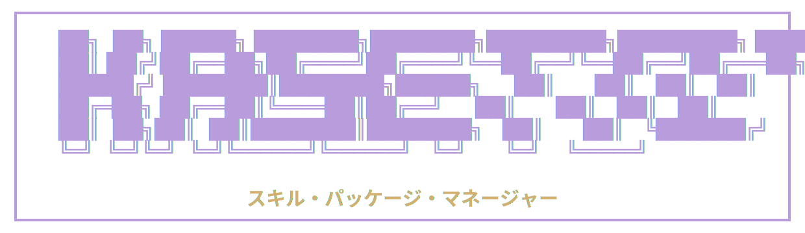

<p align="center">
  <a href="https://www.kasetto.dev/"></a>
</p>

<p align="center">
  <a href="https://github.com/pivoshenko/kasetto/actions/workflows/ci.yaml"></a>
  <a href="https://github.com/pivoshenko/kasetto/releases"></a>
  
  <a href="https://github.com/pivoshenko/kasetto/blob/main/LICENSE-MIT"></a>
  <a href="https://stand-with-ukraine.pp.ua"></a>
</p>

<p align="center">
  <a href="https://backlinklog.com/listing/kasetto.dev?utm_source=backlinklog&utm_medium=badge"></a>
</p>

<p align="center">
  A declarative AI agent environment manager, written in Rust.
</p>

Name comes from the Japanese word **カセット** (*kasetto*) - cassette. Think of Skills and MCPs as cassettes you plug in, swap out, and share across machines.

## Why Kasetto

There are good tools in this space already - [Vercel Skills](https://github.com/vercel-labs/skills) installs skills from a curated catalog, and [Claude Plugins](https://claude.com/plugins) offer runtime integrations. Both work well for one-off installs, but neither gives you a declarative, version-controlled config.

Kasetto is a **community-first** project that solves a different problem: **declarative, reproducible skill management across machines and agents.**

- **Declarative** — one YAML config describes your entire skill setup. Version it, share it, bootstrap a whole team in seconds. The config is the source of truth — readable, auditable, version-controlled.
- **Enterprise & private repos** — GitHub, GitLab, Bitbucket, Codeberg, Gitea, and self-hosted instances out of the box. Onboard new engineers in one command. Everyone gets the exact same environment — zero drift, zero surprises.
- **Multi-agent** — every major AI agent supported: Claude Code, Cursor, Codex, Windsurf, Copilot, Gemini CLI, and [many more](#supported-agents). One config, every agent updated.
- **Skills & MCP** — any directory with a `SKILL.md` is a skill — no registry, no boilerplate. MCP server configs are auto-merged into every supported format (Cursor JSON, Claude JSON, Copilot VS Code, Codex TOML).
- **Speed** — written in Rust. SHA-256 content hashing and lock file diffing mean only what changed gets touched. Full sync across every agent finishes in seconds.
- **Universal** — single static binary for macOS, Linux, and Windows. Install as `kasetto`, run as `kst`. CI-friendly with `--json` output and proper exit codes.

> Inspired by [uv](https://github.com/astral-sh/uv) - what uv did for Python packages, Kasetto aims to do for AI skills.

## Install

### Standalone Installer

**macOS and Linux:**

```bash
curl -fsSL kasetto.dev/install | sh
```

**Windows:**

```powershell
powershell -ExecutionPolicy Bypass -c "irm kasetto.dev/install.ps1 | iex"
```

### Homebrew

```bash
brew install pivoshenko/tap/kasetto
```

### Scoop (Windows)

```bash
scoop bucket add kasetto https://github.com/pivoshenko/scoop-bucket
scoop install kasetto
```

### Cargo

```bash
cargo install kasetto
```

## Getting Started

**1. Scaffold a config:**

```bash
kst init            # creates ./kasetto.yaml in the current directory
kst init --global   # or a global one at ~/.config/kasetto/kasetto.yaml
```

Edit the generated `kasetto.yaml` — pick an `agent`, add a `skills:` source, and you're ready to sync.

**2. Sync skills into your agents:**

```bash
# uses ./kasetto.yaml in the current directory
kst sync

# or point at a shared team config over HTTPS
kst sync --config https://example.com/team-skills.yaml
```

Want bare `kst sync` to always pull from a remote URL? Persist it in `~/.config/kasetto/config.yaml`:

```yaml
source: https://github.com/pivoshenko/pivoshenko.ai/blob/main/kasetto.yaml
```

After that, `kst sync` resolves the URL automatically — no `--config` flag needed.

That's it. Kasetto pulls the skills and installs them into the right agent directory. The next time you run `sync`, only what changed gets updated.

See [pivoshenko/pivoshenko.ai](https://github.com/pivoshenko/pivoshenko.ai) for a community example pulling skills from multiple packs for Claude Code and OpenCode.

**3. See what's installed:**

```bash
kst list      # interactive browser with vim-style navigation
kst doctor    # version, paths, last sync status
```

## Commands

One-line synopsis below. Full flags and examples in the [commands reference](https://kasetto.dev/docs/commands).

- **`kst init`** — generate a starter `kasetto.yaml` (local or `--global`).
- **`kst sync`** — read config, fetch sources, install skills + MCPs into agent dirs.
- **`kst list`** — interactive TUI (or plain/JSON) of installed skills and MCPs from the lock file.
- **`kst doctor`** — local diagnostics: version, paths, last sync status, broken skills.
- **`kst clean`** — remove tracked skills and MCP configs for the given scope.
- **`kst self update`** — fetch latest release, verify SHA256, replace binary in place.
- **`kst self uninstall`** — remove installed assets, data, and the binary.
- **`kst completions <shell>`** — emit shell completion script (`bash`/`zsh`/`fish`/`powershell`).

Most commands accept `--json`, `--plain`, `--quiet`, and `--project | --global`.

## Configuration

When `--config` is omitted, Kasetto looks for config in this order:

1. `$KASETTO_CONFIG` env var
2. `source:` key in `$XDG_CONFIG_HOME/kasetto/config.yaml`
3. `./kasetto.yaml`
4. `$XDG_CONFIG_HOME/kasetto/kasetto.yaml` (or `~/.config/kasetto/kasetto.yaml`)

Run `kst init` to scaffold a local config, or `kst init --global` for the global one.

```yaml
# Choose an agent preset (single or multiple)...
agent: codex
# agent:
#   - claude-code
#   - cursor

# ...or set an explicit path (overrides agent)
# destination: ./my-skills

# Install scope: "global" (default) or "project"
# scope: project

skills:
  # Pull specific skills from a GitHub repo
  - source: https://github.com/org/skill-pack
    branch: main
    skills:
      - code-reviewer
      - name: design-system

  # Sync everything from a local folder
  - source: ~/Development/my-skills
    skills: "*"

  # Pin to a git tag or commit
  - source: https://github.com/acme/stable-skills
    ref: v1.2.0
    skills:
      - name: custom-skill
        path: tools/skills

  # Scope discovery to a nested directory inside the source
  - source: https://github.com/acme/agents
    sub-dir: plugins/swift-apple-expert
    skills: "*"

# MCP servers (optional)
mcps:
  # Discover all packs in the repo
  - source: https://github.com/org/mcp-pack
    mcps: "*"

  # Pick specific files from a monorepo (names resolved from mcps/ dir)
  - source: https://github.com/org/monorepo
    ref: v1.4.0
    mcps:
      - github        # → mcps/github.json
      - linear        # → mcps/linear.json
```

Full key reference, merge rules, and `extends:` inheritance live in the [configuration docs](https://kasetto.dev/docs/configuration).

## Supported Agents

Set the `agent` field and Kasetto figures out where to put things.

<details>
<summary>Full list of supported agents</summary>

<br />

| Agent          | Config value     | Install path                    |
| -------------- | ---------------- | ------------------------------- |
| Amp            | `amp`            | `~/.config/agents/skills/`      |
| Antigravity    | `antigravity`    | `~/.gemini/antigravity/skills/` |
| Augment        | `augment`        | `~/.augment/skills/`            |
| Claude Code    | `claude-code`    | `~/.claude/skills/`             |
| Cline          | `cline`          | `~/.agents/skills/`             |
| Codex          | `codex`          | `~/.codex/skills/`              |
| Continue       | `continue`       | `~/.continue/skills/`           |
| Cursor         | `cursor`         | `~/.cursor/skills/`             |
| Gemini CLI     | `gemini-cli`     | `~/.gemini/skills/`             |
| GitHub Copilot | `github-copilot` | `~/.copilot/skills/`            |
| Goose          | `goose`          | `~/.config/goose/skills/`       |
| Junie          | `junie`          | `~/.junie/skills/`              |
| Kiro CLI       | `kiro-cli`       | `~/.kiro/skills/`               |
| OpenClaw       | `openclaw`       | `~/.openclaw/skills/`           |
| OpenCode       | `opencode`       | `~/.config/opencode/skills/`    |
| OpenHands      | `openhands`      | `~/.openhands/skills/`          |
| Replit         | `replit`         | `~/.config/agents/skills/`      |
| Roo Code       | `roo`            | `~/.roo/skills/`                |
| Trae           | `trae`           | `~/.trae/skills/`               |
| Warp           | `warp`           | `~/.agents/skills/`             |
| Windsurf       | `windsurf`       | `~/.codeium/windsurf/skills/`   |

</details>

Don't see your agent? Use the `destination` field to point at any path.

## Private Repositories & Enterprise

Private GitHub, GitLab, Bitbucket, Codeberg, Gitea, and self-hosted instances work via env-var tokens (`GITHUB_TOKEN`, `GITLAB_TOKEN`, `BITBUCKET_TOKEN`, `GITEA_TOKEN`, etc.) — no login command, no credentials file. The same tokens apply to remote `--config` URLs.

Full host table and auth resolution rules in the [authentication docs](https://kasetto.dev/docs/authentication).

## Contributing

See [CONTRIBUTING.md](CONTRIBUTING.md) for development setup and guidelines.

## License

Licensed under either [MIT](LICENSE-MIT) or [Apache-2.0](LICENSE-APACHE), at your option.
